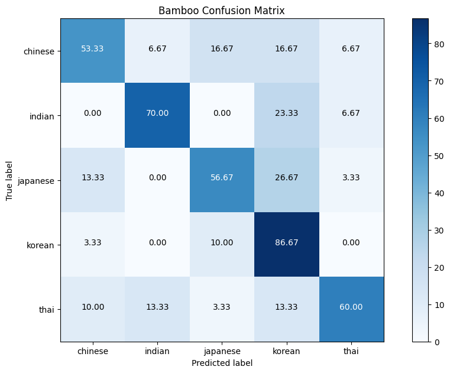

# CLASSIFICATION OF CUISINE BASED ON THE RECIPES

# Overview     
    This project centers around the classification of cuisine types based on the ingredients used in various recipes. The dataset, meticulously curated by researcher Yong-Yeol and made available through IBM's servers as part of a IBM Data Science Coursera course, encompasses tens of thousands of recipes from three distinct culinary sources. The goal of this endeavor is to develop a robust machine learning model capable of accurately predicting the cuisine category solely from the provided ingredients. This task holds immense practical significance, finding applications in recommendation systems, culinary research, and menu planning. Leveraging the comprehensive dataset, along with the utilization of advanced machine learning techniques, makes this project a promising venture in the domain of food science and data analytics.

# Data Preprocessing
 - The dataset comprises tens of thousands of recipes. The original column named 'country' was renamed to 'cuisine' to better reflect the scope of the project.
 - To ensure consistency, all cuisine names were standardized to begin with an uppercase letter, ensuring uniformity in the dataset.
 - Addressed variations in cuisine names, such as 'Vietname' and 'Vietnamese', 'Italy' and 'Italian', by merging them for a more cohesive dataset.
 - Additionally, recipes with very few instances were carefully reviewed to maintain data integrity and relevance to the classification task.

# Data Modelling and Evaluation
## Decision Tree Modeling
   Decision trees serve as the foundation of our modeling approach. They belong to the category of supervised machine learning algorithms, capable of handling both classification and regression tasks. Operating on the principle of constructing a tree-like model, decisions are based on features within the data. Each internal node represents a feature test, while each leaf node signifies a class label. Our objective is to build a model proficient in accurately predicting class labels for new data based on their feature values.  

## Data Splitting
   The dataset was strictly for the recipes for just some of the Asian (Korean, Japanese, Chinese, Thai) and Indian cuisines. The dataset strategically wass divided into two subsets: the training set and the test set. This division allows us to effectively train the model on one portion and rigorously evaluate its performance on the other.

## Model Evaluation
  To gauge the effectiveness of our decision tree model, a suite of evaluation metrics was employed. One key metric, the confusion matrix, stands as a powerful visual representation of the model's predictions. It succinctly encapsulates the counts of true positives, true negatives, false positives, and false negatives, providing crucial insights into the model's performance.

  The following confusion matrix shows the results of our decision tree model on the recipes:

  
  From the confusion matrix we can see that the  model made a total of 100% predictions, of these predictions:
  - 53.33% of the **chinese** recipes in test data set were correctly classified by the decision tress, 6.67% were misclassified as **indian**, 16.67% were misclassified as **Japanese**, 16.67% were misclassified as **Korean** & 6.67% were misclassified as **thai** 
  - 70.0% of **Indian** recipes are classified correctly, 23.33% are misclassified as **korean** & 6.67% are misclassified as **that**
  - 56.67% of the **Japanese** recipes are classifid correctly, 13.33% are misclassified as **Chinese**, 26.67% are misclassified as **Korean**, 3.33% are misclassified as **thai**
  - 86.67% of the **Korean** recipes are classified correctly, 10% are misclassified as **Japanese** & 3.33% are misclassified as **Chinese**
  - 60% of the **Thai** recipes are classifies correctly, 10.00% are misclassified as **Chinese**, 13.33% are misclassified as **Indian**, 3.33% are misclassified as **Japanese** & 13.33% are misclassified as **Korean**

  Using the values in the confusion matrix, I compute the evaluation metrics values for each class i.e the Accuracy, Precision, Recall and the F1-Score. THe formular for each evaluation metrics is as follows:
 
  $$\text{accuracy} = \frac{\text{true positives} + \text{true negatives}}{\text{total predictions}}$$
  Precision is the proportion of true positive predictions made by the model among all positive predictions.
    $$\text{precision} = \frac{\text{true positives}}{\text{true positives} + \text{false positives}}$$ 
  Recall, also known as sensitivity or true positive rate, is the proportion of true positive predictions made by the model among all actual positive instances in the dataset.
    $$\text{recall} = \frac{\text{true positives}}{\text{true positives} + \text{false negatives}}$$
  Finally, the F1 score is the harmonic mean of precision and recall.
     $$\text{F1 score} = 2 * \frac{\text{precision} * \text{recall}}{\text{precision} + \text{recall}}$$

  The following table shows the precision, recall, and F1 score for each class:
  |  class     | accuracy  | precision | recall   | F1 score |
  | :------:   | :-------: | :-------: | :------: | :------: |
  | Chinese    |   52.325  |  52.779   |   53.33  | 52.799   |
  | Indian     |   70.00   |  70.00    |   70.00  | 70.00    |
  | Japanese   |   56.67   |  56.67    |   56.67  | 56.67    |
  | Korean     |   86.67   |  86.67    |   86.67  | 86.67    |
  | Thai       |   60.005  |  60.006   |   60.0   | 60.003   |

  

  Based on the metrics above, we can deduce that the model Perform better for Korean Cuisne compared to others.
  
   
    

